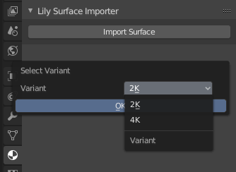

Lily Surface Scrapper
=====================

There are many sources for getting PBR textures on the Internet, but it is always a repetitive task to setup the shader once in Blender. Some sources provide an add-on to automatically handle this, but it remains painful to install a new add-on for each of them, and learn over how they slightly differ from the other one.

LilySurfaceScrapper suggest a very intuitive and unified workflow: browse your favorite library in your browser. Once you have made your choice, just copy the URL of the page and paste it in Blender. The script will prompt for potential variants if some are detected, then download the maps and setup the material.

This add-on has been designed to make it very easy to add new sources. You can just add a script in the `Scrappers/` directory, it will be automatically detected. See bellow for more information.

## Installation

Download the [last release](https://github.com/eliemichel/LilySurfaceScrapper/releases/download/v1.0.1/LilySurfaceScrapper-v1.0.1.zip), then in Blender, go to `Edit > Preferences`, `Add-on`, `Install`, browse to the zip file.

## Usage

 1. Browse the website of the source of your choice, until you find a texture, say https://cc0textures.com/view.php?tex=Metal01
 2. Copy this URL

 3. If you just opened Blender and did not save yet, the add-on is not available:

 4. Save your file, this is needed because the textures will be loaded in a directory called `LilySurface` next to it.

 5. Paste the URL of the texture:

 6. Select the variant, if there is more than one available on the page:

You can then browse the downloaded files next to your blend. Note that they are not downloaded twice if you use the same URL and variant again.

**NB** The same process is available in the World panel:

## Supported sources

The following sources are supported, feel free to suggest new ones.

Materials:

 - cgbookcase: https://www.cgbookcase.com
 - CC0Textures: https://cc0textures.com
 - Texture Haven: https://texturehaven.com

Worlds:

 - HDRI Haven: https://hdrihaven.com/

## Adding new sources

I tried to make it as easy as possible to add new sources of data. The only thing to do is to add a python file in `Scrappers/` and define in it a class deriving from `AbstractScrapper`.

You can start from a copy of [`Cc0texturesScrapper.py`](https://github.com/eliemichel/LilySurfaceScrapper/blob/master/blender/LilySurfaceScrapper/Scrappers/Cc0texturesScrapper.py) or [`CgbookcaseScrapper.py`](https://github.com/eliemichel/LilySurfaceScrapper/blob/master/blender/LilySurfaceScrapper/Scrappers/CgbookcaseScrapper.py). The former loads a zip and extracts maps while the second looks for a different URL for each map (base color, normal, etc.).

The following three methods are required:

### canHandleUrl(cls, url)

A static method (just add `@staticmethod` before its definition) that returns `True` only if the scrapper recognizes the URL `url`.

### fetchVariantList(self, url)

Return a list of variant names (a list of strings), to prompt the user. This is useful when a single page provides several versions of the material, like different resolutions (2K, 4K, etc.) or front/back textures.

This method may save info like the html page in `self`, to reuse it in `fetchVariant`.

### fetchVariant(self, variant_index, material_data)

Scrap the information of the variant numbered `variant_index`, and write it to `material_data`. The following fields of `material_data` can be filled:

 - `material_data.name`: The name of the texture, typically prefixed by the source, followed by the texture name, then the variant name.
 - `material_data.maps['baseColor']`: The path to the base color map, or None
 - `material_data.maps['normal']`: The path to the normal map, or None
 - `material_data.maps['opacity']`: The path to the opacity map, or None
 - `material_data.maps['roughness']`: The path to the roughness map, or None
 - `material_data.maps['metallic']`: The path to the metallic map, or None

## Utility functions

To implement these methods, you can rely on the following utils:

### self.fetchHtml(url)

Get the url as a [lxml.etree](https://lxml.de/tutorial.html) object. You can then call the `xpath()` method to explore the page using the very convenient [xpath synthax](https://en.wikipedia.org/wiki/XPath#Examples).

### fetchImage(self, url, material_name, map_name)

Get an image from the URL `url`, place it in a directory whose name is generated from the `material_name`, and call the map `map_name` + extension (if an extension is explicit in the URL). The function returns the path to the downloaded texture, and you can directly provide it to `material_data.maps[...]`.

### fetchZip(self, url, material_name, zip_name)

Get a zip file from the URL `url`. This works like `fetchImage()`, returning the path to the zip file. You can then use the [zipfile](https://docs.python.org/3/library/zipfile.html) module, like [`Cc0texturesScrapper.py`](https://github.com/eliemichel/LilySurfaceScrapper/blob/master/blender/LilySurfaceScrapper/Scrappers/Cc0texturesScrapper.py) does.

### self.clearString(s)

Remove non printable characters from s

## TODO

 - Handle bump map
 - Handle AO map
 - Include `lxml` more properly. I don't know the idiomatic way to package such a dependency in a Blender addon.
